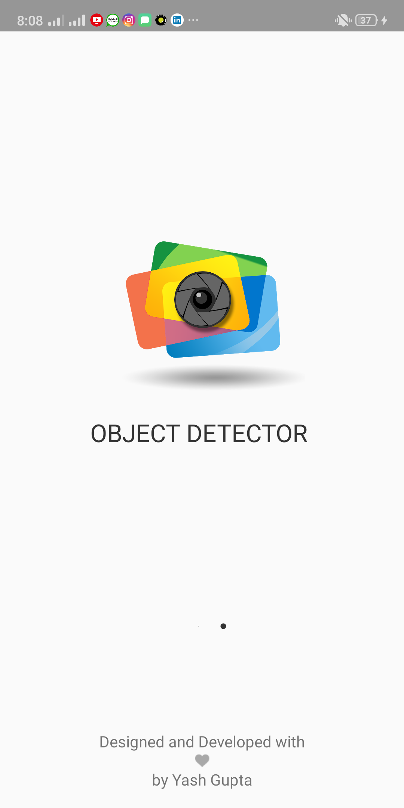
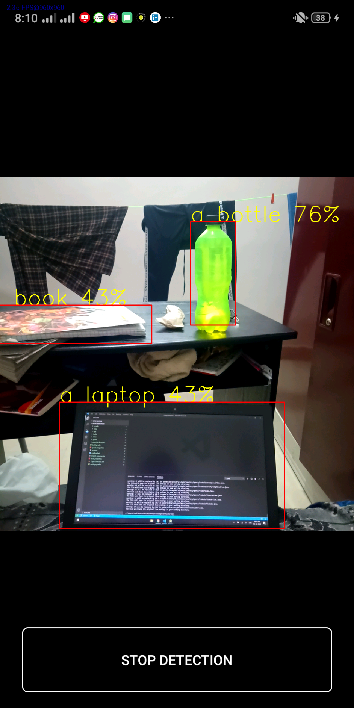
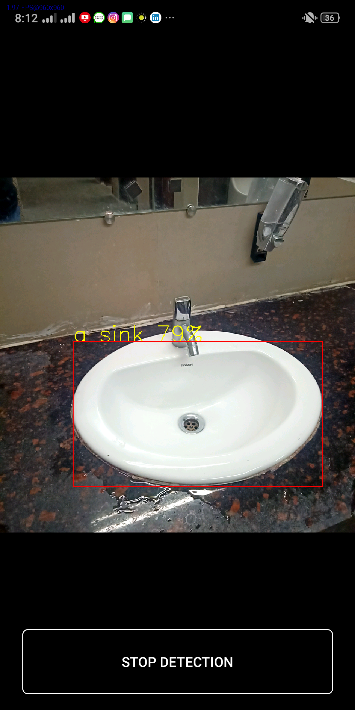

## Object Detector
This app is used to recognize and detect objects with a definite probability percentage. This app uses [Yolov3](https://pjreddie.com/darknet/yolo/) which is a real-time object detection system which is powered by [OpenCV345](https://opencv.org/).

## App Info
<b>Version:</b> 1.0 
<b>Updated on:</b> Feb 2020 
<b>Size:</b> 82.5 MB 
<b>App permissions:</b> Camera Usage and Storage Read-Write Permissions 

## Libraries Used
<b>OpenCV Library345 </b> 
<b>'com.github.ybq:Android-SpinKit:1.4.0'</b>

## Usage
* Import OpenCV Library in Project.
* Copy the <b>dnns</b> folder onto your phone external storage.
* This project uses yolov3-tiny cfg and weights which can be extended to yolov3-spp files.

Following are some of the screenshots of the app... 
 

